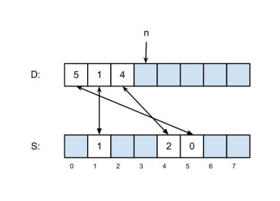

#Sparse Sets

##March 9, 2012

We look today at a clever data structure for storing sparse sets of integers on the range 0 .. u−1 and performing initialization, lookup, and insertion is time O(1) and iteration in O(n), where n is the number of elements in the set. The data structure was studied in a 1993 article “An Efficient Representation for Sparse Sets” by Preston Briggs and Linda Torczon, in Exercise 1.9 (1.8 in the first edition) of Jon Bentley’s book Programming Pearls, and in exercise 2.12 of the 1974 book The Design and Analysis of Computer Algorithms by Al Aho, John Hopcroft and Jeffrey Ullman; the data structure itself dates to the folklore of computing.

The data structure considers a universe of integers from 0 to u−1; depending on the circumstances, the integers probably map to something else, but we don’t care about that. Any given set consists of n items chose from the universe; there are no duplicates. Note that n ≤ u, certainly, and likely n is much less than u — otherwise, you would probably use a bit vector to represent the set. Note also that we are optimizing for speed at the expense of space, as a bit vector takes u bits but our data structure takes 2u integers.

Think about a bit vector. Setting a bit is a constant-time operation, as is checking if a bit is set or unset. But initializing the bit vector and iterating over the set elements of the bit vector each take time proportional to the size of the bit vector. Our sparse sets reduce the iteration to time proportional to the size of the set (rather than the size of the universe) and reduce the initialization time to a constant.

The sparse set is represented by two vectors that we will call dense (abbreviated D) and sparse (abbreviated S). Initially n, the number of elements in the set, is zero; the two vectors are uninitialized and may contain anything. To add an element 0 ≤ k < u to a set that does not already contain k, we set D[n] to k, S[k] to n, and increase n by 1, an operation that takes constant time. After this, the two vectors point to each other, which gives a test of set membership that also works in constant time: an element k is in the set if and only if S[k] < n and D[S[k]] == k>. Note that if k is not a member of the set, the value of S[k] doesn’t matter; either it S[k] will be greater than n or it will point to an element of D that doesn’t point back to it. The diagram above right shows a set with the elements 5, 1 and 4; the blue boxes may contain any value. To iterate over the elements of the set, read D[0 .. n−1], which takes time O(n), and to clear the set make n = 0, which takes time O(1); note in particular that clearing the set doesn’t require reinitialization. Other operations, including size-of, delete, union, intersection, difference, and set-equality are possible, and equally time-efficient compared to bit vectors, but we won’t discuss them here, since they are seldom used with this representation of sets. A common use of these sparse sets is with register allocation algorithms in compilers, which have a fixed universe (the number of registers in the machine) and are updated and cleared frequently during a single processing run.

Your task is to implement the insert, lookup, iterate and clear operations for sparse sets as described above. When you are finished, you are welcome to read or run a suggested solution, or to post your own solution or discuss the exercise in the comments below.

